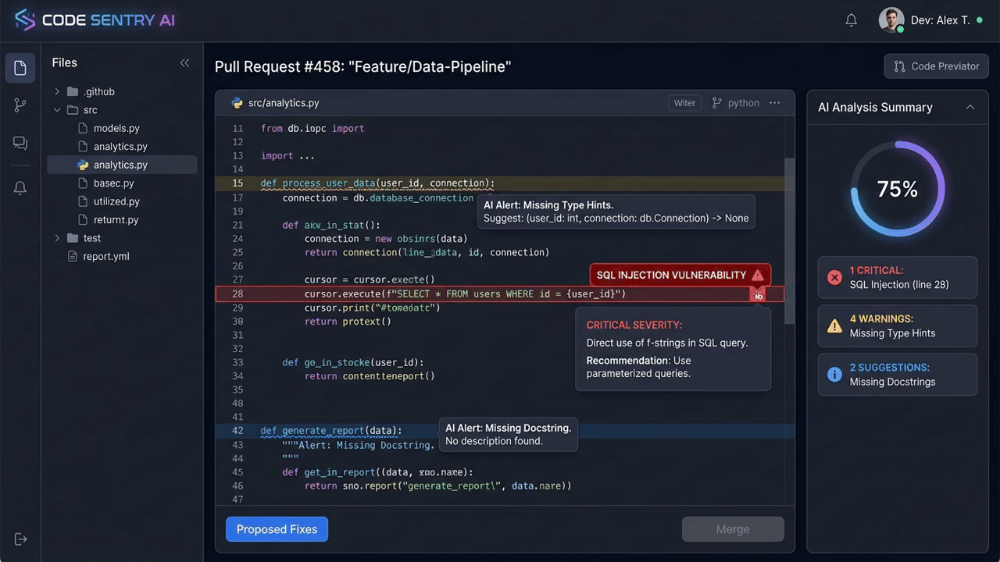

# Code Review & Pull Request Assistant 🚀

A conversational AI agent built with **Google ADK** and **Vertex AI Agent Engine** that helps engineering teams review code diffs, enforce team coding standards, catch security vulnerabilities, and persist structured PR review logs.



---

## 📌 Overview
The **Code Review & Pull Request Assistant** acts as an automated, intelligent co-pilot for software teams. It automates repetitive review tasks—such as checking for missing docstrings, verifying type hint coverage, and auditing SQL queries for injection risks—while staying strictly grounded in team PR guidelines and long-term developer preferences.

---

## ✨ Key Features
- 🔍 **Automated Static Linting**: Performs static analysis on Python code snippets via `run_linter_check` to flag missing return type annotations, missing Google-style docstrings, and security anti-patterns.
- 📚 **Grounded PR Guidelines (RAG)**: Queries an official team guidelines corpus using `consult_pr_guidelines` powered by Vertex AI RAG Engine.
- 🗄️ **Firestore Review Persistence**: Queries (`search_code_reviews`), fetches (`get_code_review_details`), and records (`save_code_review`) pull request review logs in Cloud Firestore.
- 🧠 **Cross-Session Long-Term Memory**: Automatically remembers developer preferences, team rules, and past feedback across sessions using Vertex AI Memory Bank.
- ☁️ **Public Media Asset Hosting**: Configured with a public Cloud Storage bucket (`gs://code-review-assistant-assets-qwiklabs-gcp-04-71f8c49abd0b`) to host and embed review charts and architecture diagrams inline.
- 💻 **Interactive UI & Playground**: Complete with an ADK Web playground UI, A2A protocol endpoint, and Agent Runtime cloud deployment.

---

## 🛠️ Google Cloud Tools & Architecture

| Google Cloud Service | Purpose & Implementation |
| :--- | :--- |
| **Vertex AI Memory Bank** | Manages persistent long-term developer memories (`PreloadMemoryTool`, `LoadMemoryTool`, `add_session_to_memory`) across user sessions. |
| **Cloud Firestore** | Stores structured pull request review records in the `code_reviews` collection. |
| **Cloud Storage (GCS)** | Publicly accessible bucket (`gs://code-review-assistant-assets-qwiklabs-gcp-04-71f8c49abd0b`) for storing public review assets and diagrams. |
| **Vertex AI RAG Engine** | Serverless vector index holding chunked vector embeddings of `scripts/code_review_pr_guidelines.md` for grounded answers. |
| **Imagen 3 Image Generation** | Generates visual architecture diagrams and code flowcharts for PR changes. |
| **A2UI Cards & Tables** | Renders interactive, rich UI cards and issue severity tables in the chat frontend. |
| **Vertex AI Agent Runtime** | Deployed backend service running `google-adk` on Agent Engine with A2A protocol support. |

---

## 🚀 Quick Start

### 1. Run Local ADK Playground
To launch the interactive ADK Web UI locally:
```bash
agents-cli playground --port 8080 --host 0.0.0.0
```
Open [http://localhost:8080/dev-ui/?app=app](http://localhost:8080/dev-ui/?app=app) in your browser.

### 2. Execute CLI Queries
To test agent queries directly from your terminal:
```bash
agents-cli run "Review this code snippet: def login(user): return 'SELECT * FROM users WHERE u=' + user"
```

### 3. Deploy to Agent Runtime
To deploy or update the agent on Vertex AI Agent Engine:
```bash
agents-cli deploy --update-env-vars "MEMORY_BANK_ID=284518424896339968" --no-confirm-project
```

---

## 📄 License
Licensed under the Apache 2.0 License.
